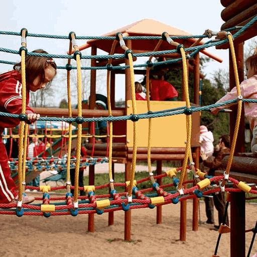
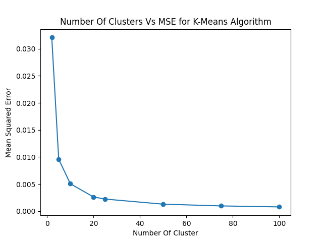

# k-means-clustering

K-Means Clustering on RGB image of shape 512 × 512 × 3.

# Introduction

Clustering is an unsupervised machine-learning technique used to group similar data points based on some measure of similarity or distance. K-Means clustering is a popular algorithm for this task and is widely used in various applications such as image segmentation, market segmentation, and data mining.

# K-Means Algorithm

This is a classic clustering algorithm that relies on the concept of centroids and their Euclidean distances from the observed data points. The basic concept works on the following set of rules:

1) Assign a fixed number of centroids randomly in the parameter space (the number of centroids will define the number of clusters formed at the end of the execution of the algorithm). These centroids need not be one of the points in the observation set and can literally be random coordinates in our multi-dimensional space.

2) Calculate the closest centroid from each data point in the observation set and assign the data point to that centroid's cluster.

3) Move the centroid to the 'center-of-mass' of the cluster it created with the help of our data points from the observation set.

4) Repeat Step 2 and see if any points have changed their clusters from the ones they were previously assigned. If the condition holds, you can move to Step 3; otherwise, go to Step 5.

5) Finish

Although the algorithm might appear to be constructing clusters based on distances, this assumption is untrue. The k-means clustering algorithm works primarily on minimizing the intra-cluster variance, which is why the metric of computation for the accuracy of a k-means cluster is WCSS (within-cluster sum of squares).

# Experimental Setup

Implementing the K-Means algorithm first loads the sample image(512x512x3) and flattens it into a 2D array(262144x3) of pixel values normalized between 0-1.

It then initializes the k centroids randomly from the dataset. It iteratively assigns each pixel to the nearest centroid and updates the centroid positions based on the mean of the assigned pixels.

Sometimes, due to the same sampled centroids, which have the same RGB values, some of the centroids don’t even get a single data point in the corresponding cluster. In that case, implementation is again to sample the new centroid from the dataset given, which was not sampled before. This process ensures the unique K centroids for clustering the given image pixels to exactly K unique clusters.

The implementation also includes a function to replace each pixel in the image with the value of its nearest centroid, resulting in a compressed information version of the original image with reduced color depth.

The implementation also has the error measure between the original image and the image obtained with the metric of mean squared error(MSE), which has less color depth than the original image.

#  Results

In an implementation, the K-Means algorithm was applied to a sample image of a playing child in the park, as given in Figure 1, and ran the K-means clustering algorithm for various values of K = {2,5,10,20,25,50,75,100} to analyze its performance. The plot of the Mean Squared Error(MSE) as a function of the number of clusters K as calculated based on the implementation of the K-means clustering algorithm, which is given in Table 1 to determine
 
 

  <figure>
    

      
    

  </figure>
  Figure 1: Original image

 
Figure 1 shows the original image, while Figure 2 shows the compressed version of the image with reduced color depth fo different values of K = {2,5,10,20,25,50,75,100}.
 
 

|         |         |         |         |
|:-------:|:-------:|:-------:|:-------:|
|  |  |  | |
|  |  |  |  |

Figure 2: K-means clustering algorithm to image segmentation showing the initial images together with their K-means segmentations obtained using various values of K. This also illustrates the use for data compression, in which smaller values of K give higher compression at the expense of poorer image quality.

 

 
  
|K(#Clusters)|Mean squared error(MSE)|
| :---------------- | :------: |
|2|0\.03206917602224996|
|5|0\.009577374877504022|
|10|0\.0048920065942455885|
|20|0\.0026150632508193344|
|25|0\.002192040119323022|
|50|0\.001297891665852946|
|75|0\.0009528732615442834|
|100|0\.0007729332467604249|

Table 1: Mean squared error for different values of K

 

  <figure>
    

      
    

  </figure>
  Figure 3: Plot of MSE as a function of the number of clusters

 
Figure 3 shows the plot of MSE as a function of K. As expected, the MSE decreases as clusters increase since the centroids become more representative of the pixel values. However, the rate of decrease slows down as K increases, indicating diminishing returns in terms of compression quality.

# Conclusion

In conclusion, the K-Means clustering algorithm was implemented and applied to a sample image to demonstrate its effectiveness in reducing color depth and compressing images. Implementation analyzed the algorithm's performance by plotting the Mean Squared Error as a function of the number of clusters and found diminishing returns regarding compression quality as the number of clusters increases. Here for the given problem, the best value of K is 20 as there are no significant changes in error afterward for the values of K more outstanding than 20.

